# Production-Grade Data Pipeline  
### AWS Glue → Amazon S3 → Snowflake → dbt (Development & Production)

---

## Executive Summary
This project demonstrates the end-to-end design, implementation, validation, and production deployment of a modern batch data pipeline using AWS, Snowflake, and dbt.

The pipeline ingests semi-structured JSON data from a public GitHub repository, lands it in Amazon S3 via AWS Glue, loads it into Snowflake using a secure storage integration and external stage, and transforms the data through a layered dbt modeling approach (RAW → TRANSFORM → MART).

The primary goal of this project is to showcase **real-world data engineering practices**, including:
- Cloud IAM and service isolation
- External data access patterns
- Warehouse-native transformations
- dbt macros, testing, and documentation
- Environment separation and production promotion

All cloud infrastructure was intentionally **validated and then torn down** to prevent ongoing costs. This repository serves as the permanent proof of design decisions, execution, and correctness.

---

## Architecture Overview
The pipeline follows a standard, production-oriented batch ingestion pattern.

**High-level flow:**
1. AWS Glue ingests JSON data from a public source
2. Data is written to Amazon S3
3. Snowflake accesses S3 data via a storage integration and external stage
4. dbt transforms and tests the data
5. Curated models are deployed to a production database

### Architecture Diagram
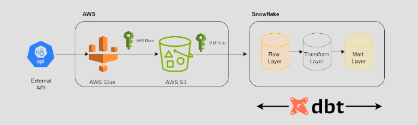

This architecture mirrors patterns commonly used in modern analytics platforms.

---

## Table of Contents
- [Technology Stack](#technology-stack)
- [Security & IAM Design](#security--iam-design)
- [Data Ingestion](#data-ingestion)
- [Snowflake External Data Access](#snowflake-external-data-access)
- [dbt Project Design](#dbt-project-design)
- [Transformation Layers](#transformation-layers)
- [Testing & Data Quality](#testing--data-quality)
- [Production Deployment](#production-deployment)
- [Validation & Verification](#validation--verification)
- [Repository Contents](#repository-contents)
- [Infrastructure Teardown](#infrastructure-teardown)

---

## Technology Stack
- **AWS Glue** – Serverless batch ingestion
- **Amazon S3** – Object storage and data lake
- **Snowflake** – Cloud data warehouse
- **dbt (Core & Cloud)** – Transformations, testing, orchestration
- **Python & SQL** – ETL logic and transformations

---

## Security & IAM Design
Security and access control were implemented using separate IAM roles to enforce least-privilege access and service isolation.

### Glue Service Role
- Trusted by the AWS Glue service
- Permissions limited to:
  - Writing data to the S3 bucket
  - Logging execution details to CloudWatch

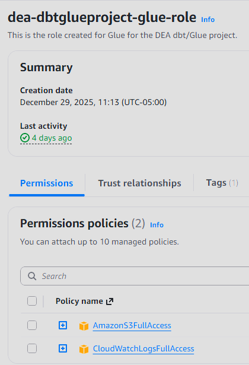

### Snowflake Storage Integration Role
- Trusted by Snowflake via External ID
- Read-only access to a specific S3 data prefix
- Used exclusively by Snowflake to read external data

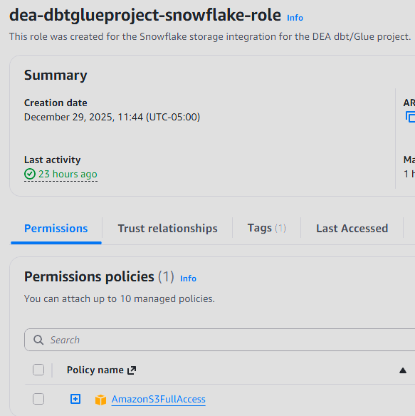

This separation mirrors production-grade security patterns used in enterprise environments.

---

## Data Ingestion
Data ingestion was implemented using AWS Glue.

Key characteristics:
- Serverless batch ingestion
- Pulls JSON data from a public GitHub repository
- Writes raw data directly to Amazon S3
- Executed manually for validation

### Ingestion Validation
- Glue job completed successfully
- Data confirmed in the S3 data directory
- Execution logs reviewed for errors

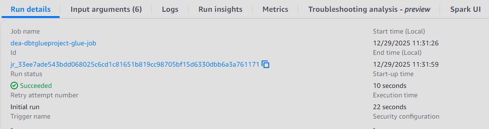
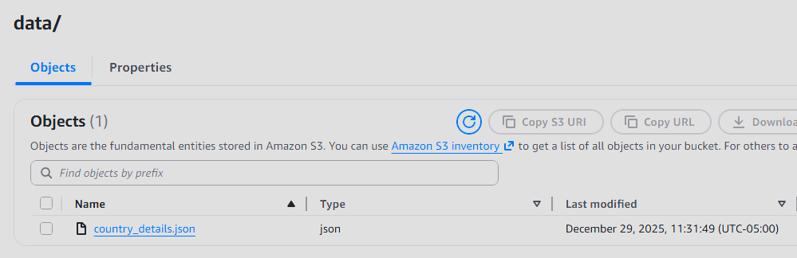

---

## Snowflake External Data Access
Snowflake was configured to read data directly from Amazon S3 using native external access features.

Configuration included:
- Dedicated Snowflake database for the project
- Storage integration referencing:
  - S3 bucket and data prefix
  - IAM role with restricted access
- External stage pointing to the S3 data location
- Raw table designed to store semi-structured data

### Verification
- External stage access confirmed
- Data successfully visible from Snowflake

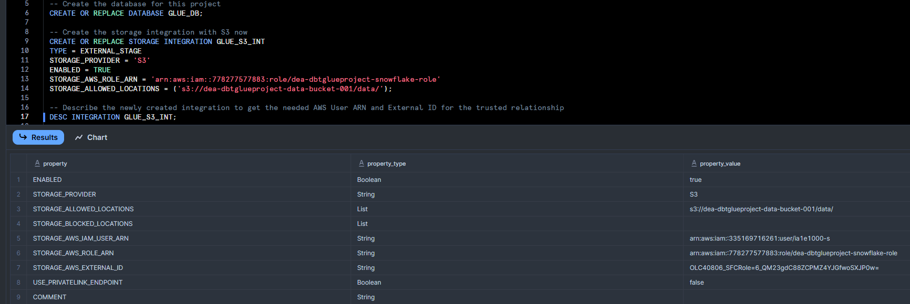
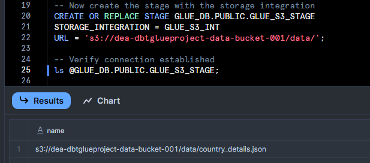

This approach minimizes data movement and aligns with Snowflake best practices.

---

## dbt Project Design
The dbt project was structured to reflect production analytics workflows.

Design highlights:
- Clear separation between development and production environments
- Layered model organization
- Reusable macros to manage ingestion behavior
- Model-level documentation and testing

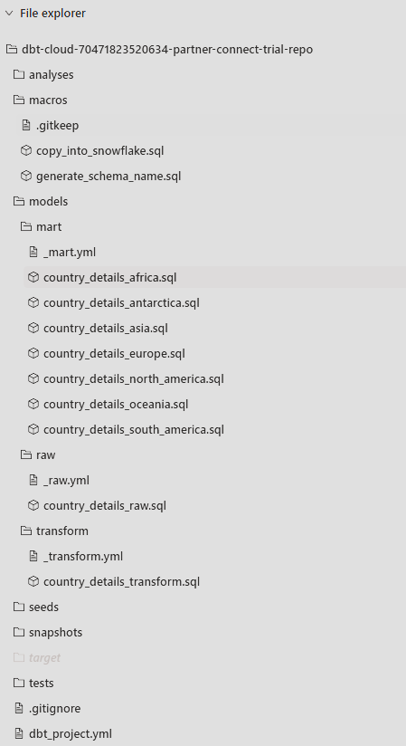

---

## Transformation Layers

### RAW Layer
- Ingests data from the external stage into Snowflake-managed tables
- Performs minimal transformations to preserve source fidelity
- Adds an ingestion timestamp for traceability
- Uses a macro-driven approach to ensure idempotent batch loads

### TRANSFORM Layer
- Fully flattens nested JSON structures
- Cleans and standardizes fields
- Prepares data for analytical use cases
- Serves as the primary intermediate layer

### MART Layer
- Final, analytics-ready models
- Data grouped by continent for downstream consumption
- Optimized for BI and reporting access
- Written to a dedicated MART schema

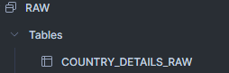
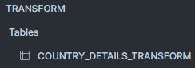
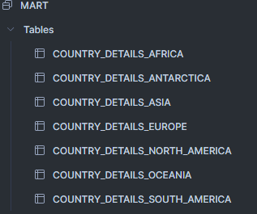

---

## Testing & Data Quality
Data quality was enforced using built-in dbt tests.

Tests applied across models:
- Uniqueness constraints
- Non-null constraints

Test definitions are maintained alongside models to ensure transparency and maintainability.

All tests passed successfully in both development and production environments.

---

## Production Deployment
A separate production database was created in Snowflake to mirror real-world deployment practices.

Deployment process:
- Configured a production environment in dbt
- Pointed production to a dedicated Snowflake database
- Executed all models and tests as a single production job
- Validated successful execution

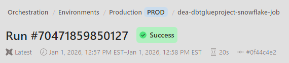
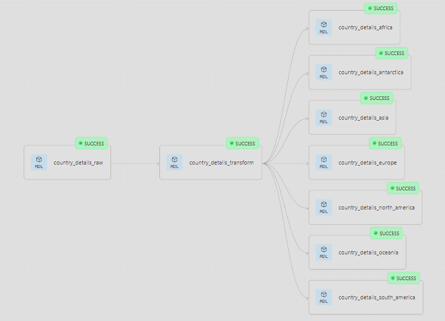

---

## Validation & Verification
Post-deployment validation confirmed:
- All expected schemas (RAW, TRANSFORM, MART) were created
- All expected tables existed in each schema
- Tables contained data in production
- Record counts were consistent with expectations

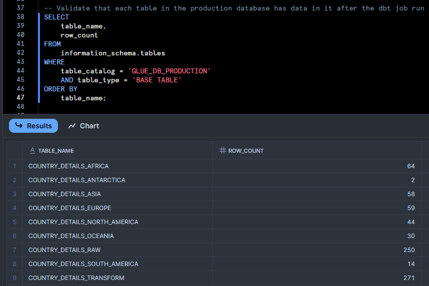

---

## Repository Contents
This repository contains:
- AWS Glue ingestion logic
- Snowflake configuration artifacts
- Complete dbt project structure
- Architecture diagrams
- Execution and validation screenshots
- Infrastructure teardown notes

Together, these artifacts provide a complete, reviewable record of the project.

---

## Infrastructure Teardown
All AWS and Snowflake resources were intentionally deleted after successful validation to avoid unnecessary cloud costs.

This repository remains as permanent evidence of:
- End-to-end pipeline ownership
- Secure cloud configuration
- Production deployment practices
- Data quality enforcement
